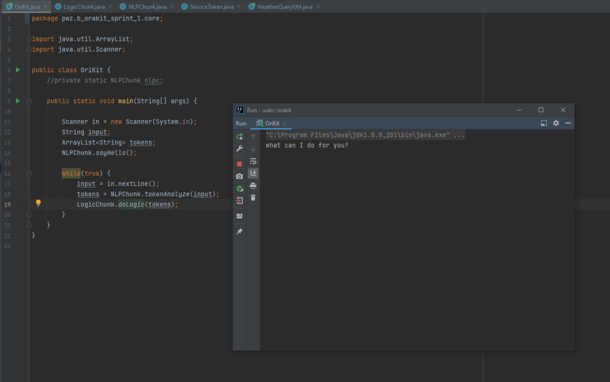
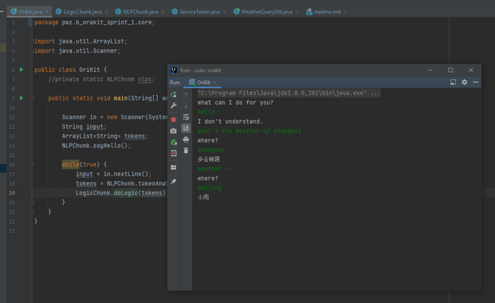
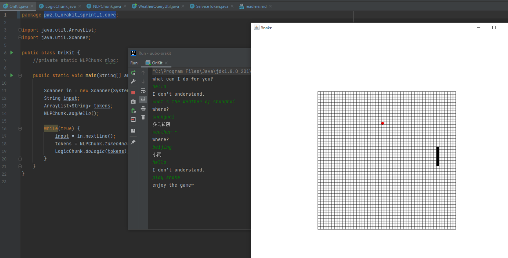

# OriKit 1.0

## 代码说明

| 文件                        | 描述              |
|---------------------------|-----------------|
| core.OraKit                 | 程序入口，提供聊天与服务调用框架     |
|core.NLPChunk|聊天输入处理模块，得到服务token|
|core.LogicChunk|依据输入的token，阻塞或非阻塞式的启用服务|
|core.ServiceToken|所有已实现服务的详细信息列表（“服务枚举”）|
|service.Snake.*|贪吃蛇服务（基于awt&swing，比在控制台实现简单些）|
|service.WeatherQueryUtil|天气查询服务，通过现成的API调用实现|

## 运行说明

### 后台逻辑

1. OriKit（`pwz.b_orakit_sprint_1.core.Orikit`）作为入口维护一个长效的控制台负责与用户进行对话（主线程）
2. 对每次与主线程的聊天执行关键字匹配，在已有服务列表中检索，对识别到的服务另启动一个线程异步进行处理
3. 服务分为阻塞式与非阻塞式，非阻塞式服务启动后原聊天过程可以继续，每项服务开始与处理结束时均有对应的合理输出

### 实际运行

通过OriKit主函数启动程序，控制台上开始进行对话触发相应服务。

  
*启动后进入对话主线程，看到问候语后可在控制台正常输入*

  
*输入中命中关键字“weather”，则进入天气查询场景*

  
*输入中命中关键字“snake”，则进入贪吃蛇游戏，此时原控制台可以继续聊天*

