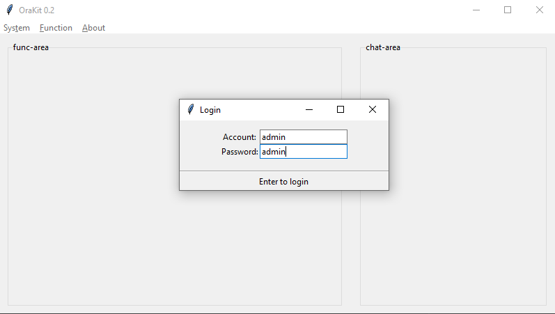
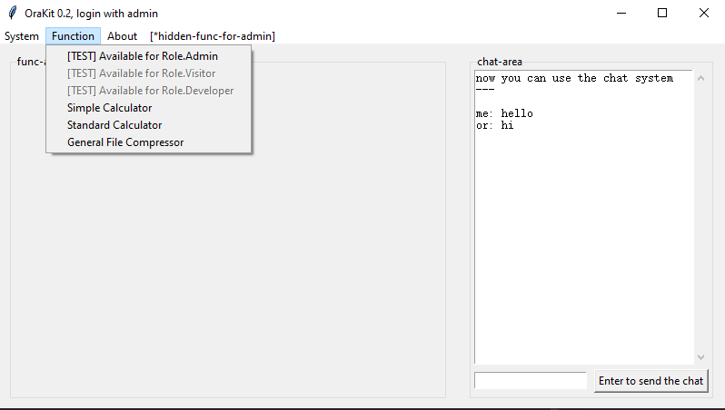
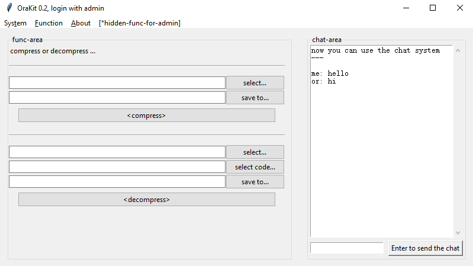

# OriKit 2.0

## 文件描述

| 文件                        | 归类  | 描述              |
|---------------------------|-----|-----------------|
| orakit.py                 | 框架  | 程序主体，提供功能框架     |
| author_util.py            | 框架  | 鉴权工具类，提供数据库相关操作 |
| func_simple_calculator.py | 功能  | 乞丐版计算器实现        |
| func_std_calculator.py    | 功能  | 简易计算器实现         |
| func_file_compressor.py   | 功能  | 乞丐版哈夫曼文件压缩工具    |


## 运行说明

纯python实现，无需编译，直接通过orakit.py主函数启动即可（`python path/to/orakit.py`）。

开发环境为python3.9，唯一外部依赖`six==1.16.0`。 GUI通过tkinter实现，理论上跨平台，后面描述基于windows10，其他平台可能有差异。

### 框架功能介绍

首次启动orakit，会自动创建sqlite3数据库，库名`orakit.db`，只有一张User表。

数据库相关信息具体可见`author_util.py`，User表中默认写入一条管理员数据，账户密码均为`admin`，可据此登录主界面。

框架层面的功能介绍见如下图文：

  
*未登录的主界面，Function下没有可用功能，通过默认账密可以以管理员身份登录*

  
*登录成功后将解锁可用功能，右侧聊天区域也被激活（但本次没有实现聊天系统的后台逻辑，聊天默认回复系统下线）*

  
*默认管理员（admin）可见的管理功能，本次仅实现新增用户，Function中实现了几个测试用的菜单项验证鉴权系统（见上一张图）*  
*系统没实现登出逻辑，换账号可以直接重复登录*


### 迭代功能介绍

登录后可以通过Function菜单选中具体功能，左侧`func-area`面板会初始化相应功能页面。 本次实现了计算器、文件压缩器两项功能，其中计算器分了两个版本。

计算器没什么好说的，不做介绍：  


文件压缩器是哈夫曼编码的简单实现，没有设计压缩文件的文件结构，码表需要单独保存。  


如上图，功能区域上半部分处理压缩过程，输入待压缩文件，选择保存位置（以及保存的文件名），点击`<compress>`按钮即可执行压缩。 

以示例文件`./The.Adventures.of.Sherlock.Holmes.txt`执行演示，选择保存到同级目录同文件名，压缩后生成`.pwzip`后缀的压缩文件及`.pwzip.huffman`后缀的码表文件：  
```bash
-rw-r--r-- 1 2087 197609 594K May 29 00:08 The.Adventures.of.Sherlock.Holmes.txt
-rw-r--r-- 1 2087 197609 347K Jun  1 13:16 The.Adventures.of.Sherlock.Holmes.txt.pwzip
-rw-r--r-- 1 2087 197609 2.0K Jun  1 13:16 The.Adventures.of.Sherlock.Holmes.txt.pwzip.huffman
```

解压功能类似，需要选择压缩文件（`***.pwzip`）、编码文件（`***.pwzip.huffman`）及解压位置，点击解压即可还原数据。
由于编码过程原文件名、文件类型等信息均没有存储，本次代码中还原后的二进制数据默认用txt作为后缀，用`save to...`所指定的文件名进行保存，如果压缩文件为其它格式，需要手动自行调整。

解压后的文件：  
```bash
-rw-r--r-- 1 2087 197609 594K Jun  1 13:16 The.Adventures.of.Sherlock.Holmes.txt.decompress.txt
```


