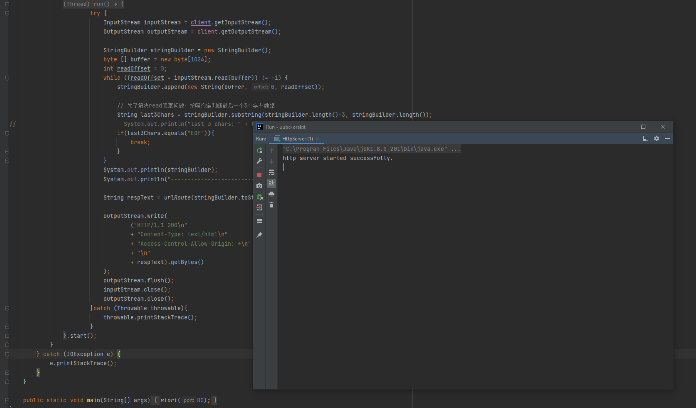
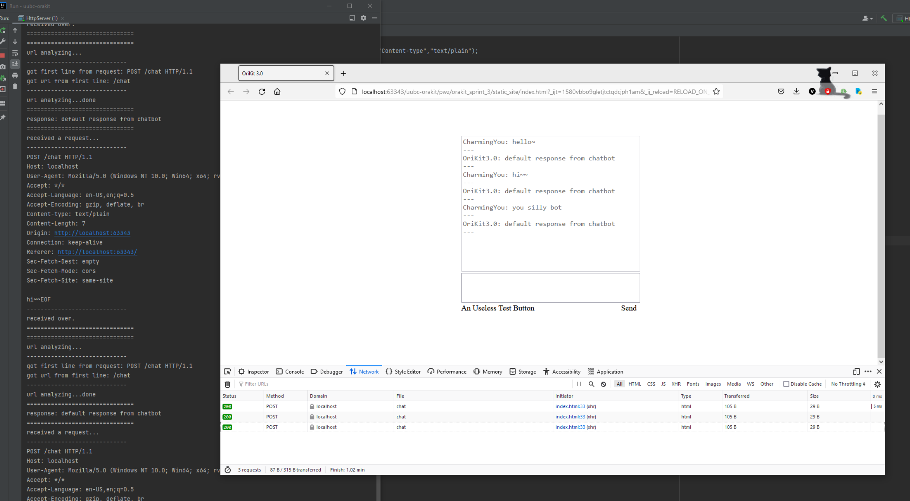
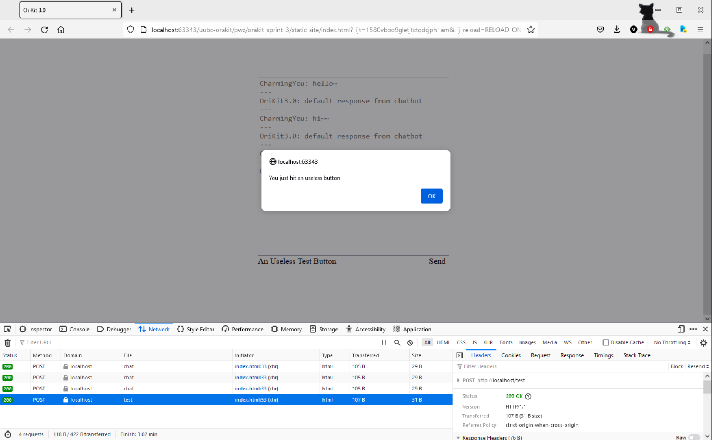

# OriKit 2.0

## 文件描述

| 文件              | 归类  | 描述            |
|-----------------|-----|---------------|
| HttpServer.java | 中间件 | Http服务器及路由函数  |
| ChatBot.java    | 后台  | 后台服务代码（Mock）  |
| index.html      | 功能  | 应用主页html及js代码 |

## 运行演示

前端页面的函数中没有指定端口，所以需要使用http默认端口80启动http服务器，或者修改前端访问的url（具体见js函数中的url变量）与http服务器监听端口相匹配，才能走通如下流程。  

  
*启动http服务器*

  
*用浏览器将首页打开，正常输入后点击发送，出发后台逻辑，结果反显在上面的Textarea*

  
*测试按钮走到另一条url路由验证逻辑，触发了一个弹窗*

