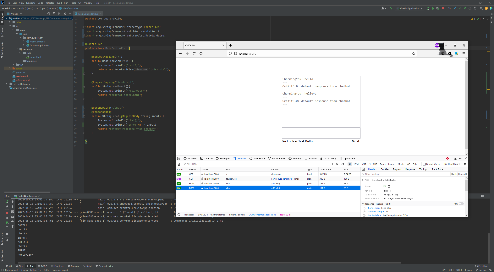

# OraKit 4.0

## 文件描述

| 文件                      | 归类   | 描述             |
|-------------------------|------|----------------|
| Orakit4Application.java | 框架代码 | Springboot程序入口 |
| MainController.java     | 业务代码 | 后台服务代码（Mock）   |

## 运行说明

通过maven安装好相关依赖，启动Orakit4Application主函数，即可通过页面访问应用主页。

  
*启动Springboot程序入口后，通过8080端口访问本地*

  
*请求正确被解析到相关逻辑进行处理，Mock结果按预期显示在聊天区域*